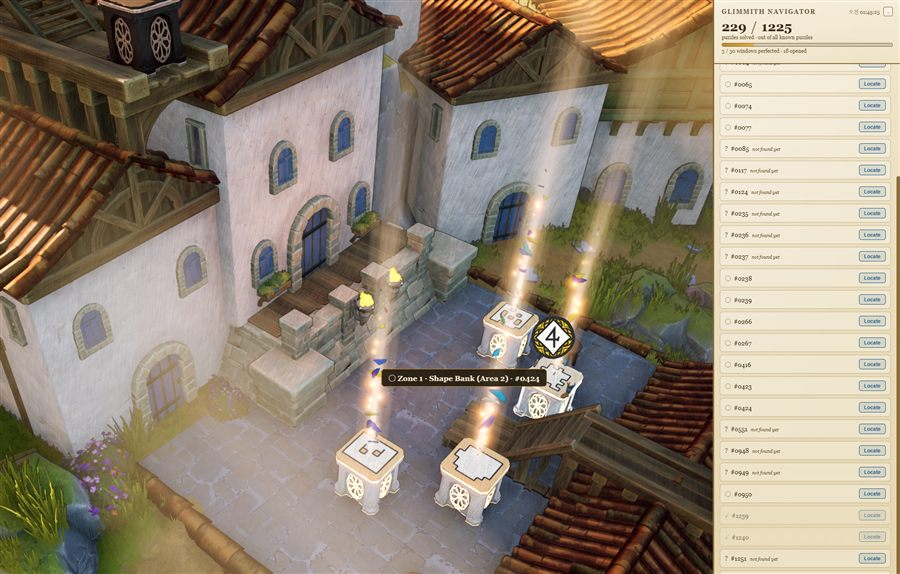
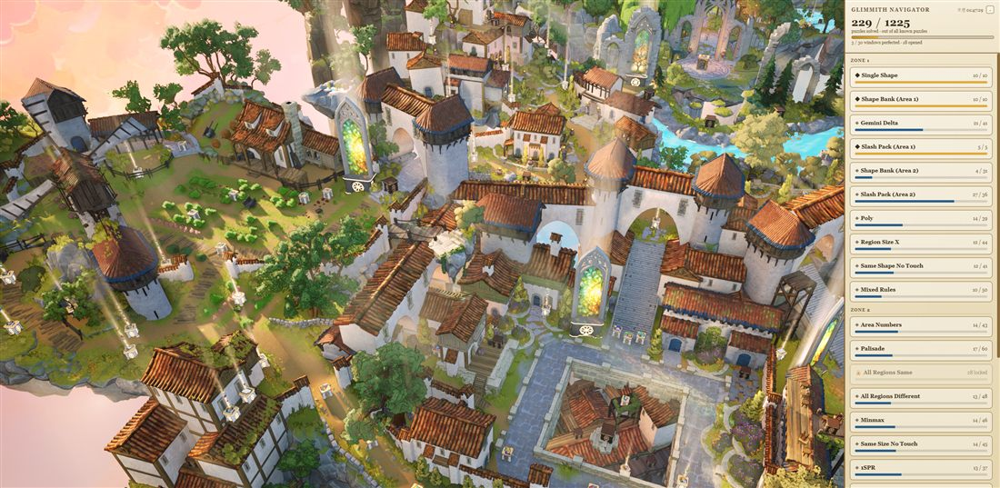

# Glimmith Navigator

An always-on-top desktop overlay for **[The Artisan of Glimmith](https://store.steampowered.com/app/4160210)** that tracks your puzzle progress and teleports you to any puzzle with one click.



The overlay stays docked to the right edge while you play, only showing itself on the world map:



## Features

- **Full puzzle list** — all 1225 puzzles, grouped by zone/window, read live from your save file.
- **One-click teleport** — "Locate" instantly moves your character to any puzzle.
- **Mouse hover tooltip** — hover over a puzzle box in-game to see its name/number (helpful when boxes are clustered together).
- **Auto show/hide** — only visible on the world map; disappears during puzzles and menus, and never steals window focus from the game.
- **Self-updating** — the puzzle list refreshes automatically from the live game, so it keeps working even if the game adds/moves puzzles later.

## Requirements

- Windows, [Node.js](https://nodejs.org/) 18+
- [UE4SS](https://github.com/UE4SS-RE/RE-UE4SS) installed into the game (see below)
- The Artisan of Glimmith (Steam)

## Setup

**1. Install UE4SS** (one-time, if you don't already have it)

Download a UE4SS release and extract `dwmapi.dll`, `UE4SS.dll`, and `UE4SS-settings.ini` into:

```
<game folder>\Geri\Binaries\Win64\
```

**2. Install this mod's script**

Copy `game-mod/Scripts/main.lua` from this repo to:

```
<game folder>\Geri\Binaries\Win64\Mods\GlimmithNavDiag\Scripts\main.lua
```

Then add this line to `<game folder>\Geri\Binaries\Win64\Mods\mods.txt` (create the file if it doesn't exist):

```
GlimmithNavDiag : 1
```

**3. Configure paths**

Edit `config.json` in this repo if your game/save location differs from the defaults:

```json
{
  "gameModsDir": "C:/Program Files (x86)/Steam/steamapps/common/The Artisan of Glimmith/Geri/Binaries/Win64/Mods/GlimmithNavDiag",
  "savePath": "%LOCALAPPDATA%/Geri/Saved/SaveGames/SaveFile1.sav"
}
```

**4. Install and run**

```
npm install
npm start
```

Launch the game — the overlay docks to the right edge of your screen and shows itself automatically once you're on the world map.

## Usage

- Click a zone/window to see its puzzle list, then **Locate** to teleport there.
- Hover any puzzle box in-game to see its name.
- Click **−** in the top-right to collapse the panel down to just your overall progress.

## Notes

- Read-only: this doesn't modify your save. Teleporting just moves your character; it doesn't solve puzzles or unlock anything you haven't earned.
- A few puzzles only appear after you're close to 100%-ing their window (the game hides some "Ruby-tier" bonus puzzles from the map until the ending) — these show with a `+` icon.
- The catalog rebuilds itself from the live game periodically, so it should keep working after game updates — but if UE4SS itself needs updating for a new game version, that's a separate manual step.
